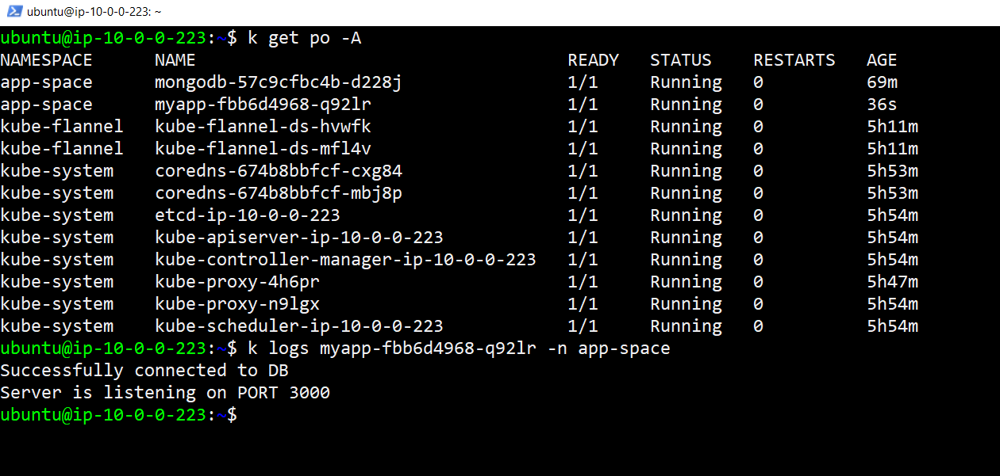
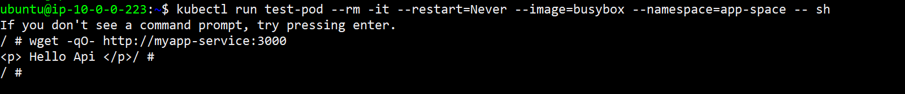
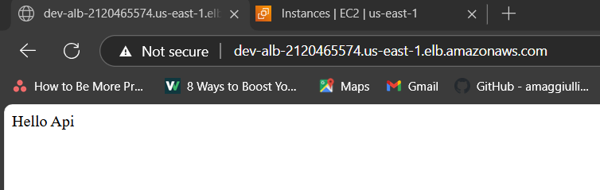

# k8s-devops
Deploy node app with mongo db database on custom k8s server(EC2 single master and EC2 single worker) with github action and terraform.


## Tools Used
1. Kubernetes
2. Helm
3. AWS
4. Github Actions
5. Terraform
6. Git
7. aws-cli
---

## Deployment stepes

### 1. Update **terraform/backend.tf** with
```
bucket = "custom-s3-bucket-name"
```

### 2. Clone repo
```bash
git clone https://github.com/Jayharer/noteapp-ec2.git
```

### 3. Create new repo in Github and Configure Following secrets in GithubActions as new repository secrets 
```
AWS_ACCESS_KEY_ID
AWS_SECRET_ACCESS_KEY
```

### 5. Push changes to new Github repo
```bash
cd noteapp-ec2
git remote remove origin
git remote add origin "<https-url-of-your-new-git-remote-repo>"
git branch -M main
git push -uf origin main
```

### 6. Create cluster with kubeadm and deploy app

### 7. Afetr successful deployment check myapp pod is running


### 8. Check myapp-service is rechable


### 8. Check ALB endpoint


### 9. Clean up, terraform destroy
```bash
cd terraform
terraform destroy
```


